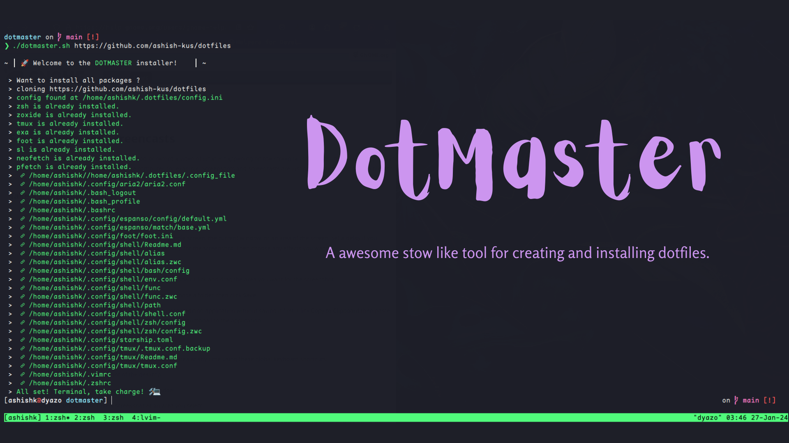

<div align="center" width="100%">  </div>

# Dotmaster - A Dotfile Automation
### Overview

dotmaster is a simple dotfile manager tool written in Bash, designed to follow the principles of stow. It helps you organize and manage your dotfiles efficiently.
### Features
1. Installs essential packages automatically.
2. Clones your dotfiles repository and sets up symlinks.
3. Creates backups of existing dotfiles before making changes.
4. Utilizes a configuration file to customize your dotfiles setup.

### Prerequisites

Bash (v4.0 or later), 
Git

### Installation

Clone the dotmaster repository:
```
git clone <repository-url>
```
Navigate to the dotmaster directory:

```
cd dotmaster
```

Make the script executable:

```
chmod +x dotmaster.sh
```
Run the script:
```
./dotmaster.sh <URL to your repository>
```

### Usage

Configure Dotfiles:

#### Understanding File Structure:

1. Create a Version-Controlled Repository:
   - Initiate a GitHub repository for your dotfiles.

2. Organize by Application:
   - In your dotfiles repository, create folders for each application's config. Naming is flexible, but it's common to name folders after the application.

3. Simulate Home Directory:
   - Within each application folder, simulate the home directory structure. For example:
```
 dotfiles/
 ├── starship/
 │   └── .config/
 │       └── starship.toml
 ├── bash/
 │   └── .bashrc
 │   └── .bash_logout
 ```

   - Assume each application's config expects its files at the home directory and structure accordingly.

This architecture allows for clear organization and simulation of home directory structure, facilitating easy synchronization of various application configurations.
Edit the config.ini file to customize your dotfiles configuration.

Install Packages:

Run the script to automatically install essential packages:
```
./dotmaster.sh <dotfile repository URL>
```
### Create Symlinks:

The script will create symlinks for your dotfiles, ensuring proper organization.
Backup Existing Dotfiles:
If dotfiles already exist, dotmaster creates a backup before making any changes.

### Configuration

The configuration file config.ini is used to specify dotfiles and their respective configurations.
Ensure the dotfiles repository is correctly set in the config.ini file.

This project is licensed under the MIT License.
